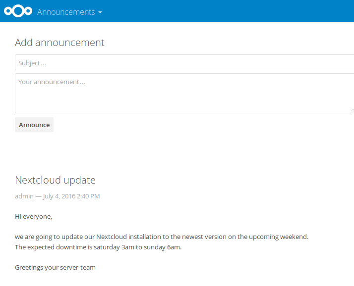
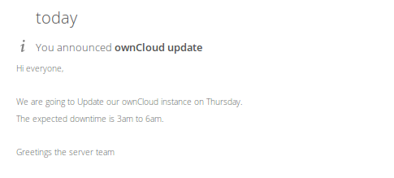

# Announcement Center

An Announcement Center app for ownCloud

This app allows administrators to post announcements

## QA metrics on master branch:

---

## Screenshots

### Announcements front page (the "Add announcement" form is admin only)

---

### The users are also informed by an activity in their stream (can not be disabled)

