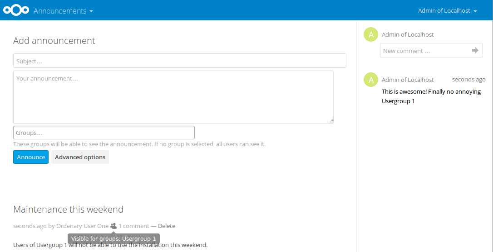

<!--
  - SPDX-FileCopyrightText: 2016-2024 Nextcloud GmbH and Nextcloud contributors
  - SPDX-FileCopyrightText: 2015 ownCloud, Inc. 
  - SPDX-License-Identifier: AGPL-3.0-or-later
-->
# Announcement center

Announce your maintenance window 🎛️, introduce a new colleague 👤 or make sure everyone knows about the big event next month 📅

* 🖌️ Markdown support
* 📑 Comments including @-mentions
* 👪 Group permissions
* ⭕ Dashboard integration
* ⚡ Activities integration
* 🔔 Notifications integration

For further information see the [Changelog](https://github.com/nextcloud/announcementcenter/wiki/Changelog).

---

### 🛠️ State of maintenance

While there are many things that could be done to further improve this app, the app is currently maintained with **limited effort**, due to the following reasons:

* The main target use-cases are working fine
* I'm a backend developer, but the next bigger features (inline attachments, emoji picker, mentions, reactions, …) require more frontend knowledge and time
* My work-focus shifted away from this app

I will continue to provide the level of maintenance I can afford, which is:

* Taking care that the app continues to work
* Make sure an update is available for compatibility with new Nextcloud server releases
* Provide feedback and background information to new or existing features

While I'm personally limited in resources to further advance this app I would be more than excited if you want to collaborate with me. I will merge pull requests for new features and frontend fixes.
